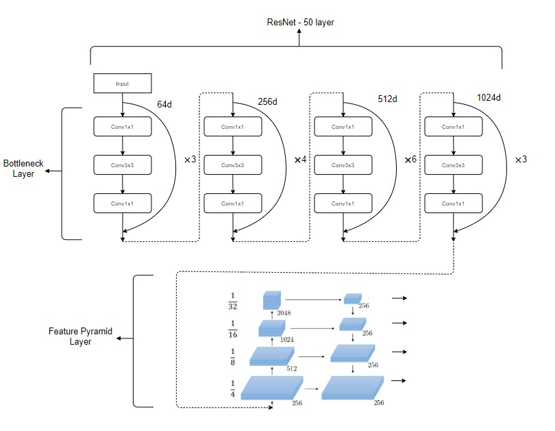
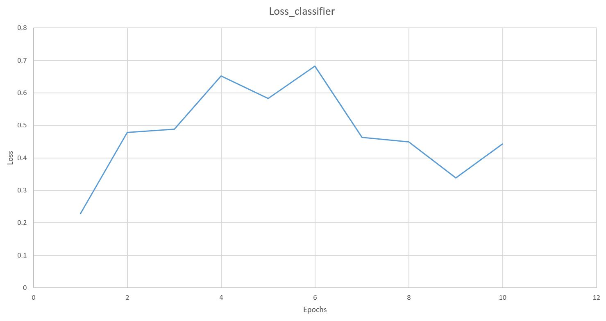
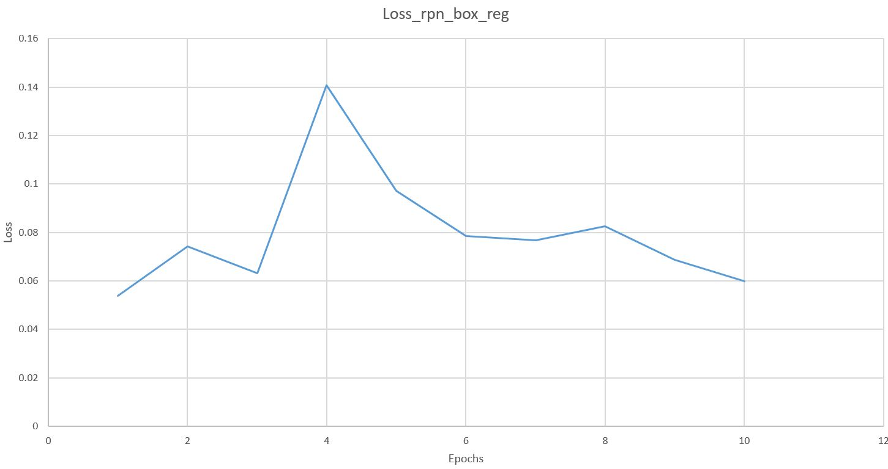
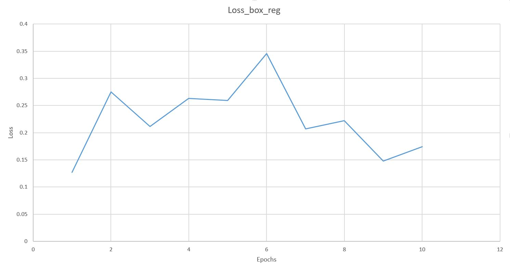
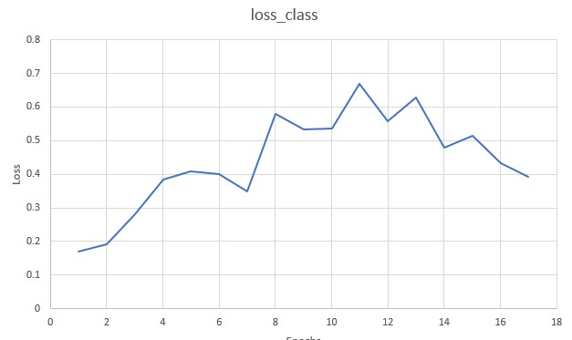
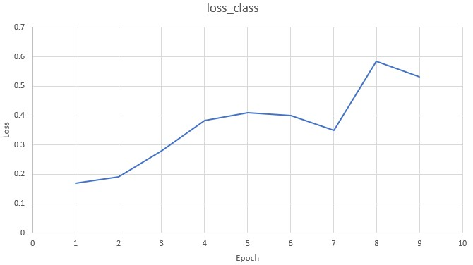
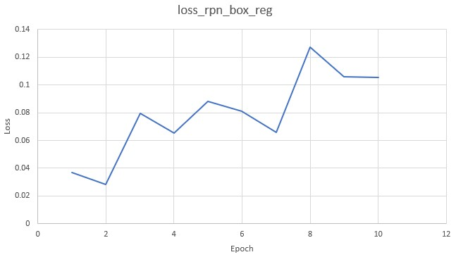

<h1 align="center">
<b>Mask RCNN - with Cityscapes Dataset</b>
</h1>

<h3 align="center">
<b>Authors: Mohamed Madi () Sandeep Patil(4861213) - s.patil-1@student.tudelft.nl </b>
</h3>

## Introduction
Mask RCNN is a state of the art instance segmentation network, which focuses on pixel level classification and outputs the bounding boxes, classes and masks. we introduce the self attention layer to the Mask RCNN network to reduce the number of parameters and to improve the efficiency of the network. Self Attention is a attention mechanism which relates different positions of the same image in order to compute/learn the representation of the image [[REF]](https://lilianweng.github.io/lil-log/2018/06/24/attention-attention.html#self-attention). We investigate the improvement in the accuracy of a Mask-RCNN model trained on Cityscapes dataset with the addition of self-attention layers for the task of instance segmentation.

## Mask RCNN Description
### Overview
Mask RCNN comprises of two stages, the <b>first stage</b> deals with the region proposals, which scans the feature pyramid network (FPN) (discussed in detail in further sections) and proposes regions which containing the object. Once the features are obtained in this stage they are confined to their respective positions in the image through the Anchor Boxes. Anchor boxes are a set of boxes which have predefined locations and sizes on the image. The classes and bouding boxes are assigned to these anchor boxes according to IOU (Intersection over Union) value. This task is performed by the network called Region Proposal Network (RPN). 

The <b>second stage</b> takes the output of region proposal network and calculates the bounding boxes, objectness scores and masks using ROIAlign [[Georgia et al]](https://arxiv.org/pdf/1703.06870.pdf). ROI Align extracts a small feature map from region of interest obtained in the first stage of the network. It uses bilinear interpolation to preserve the features from the input. Both of these stages obtain a set of input from the backbone layer directly. This setup is shown in the figure below [[REF](https://medium.com/@alittlepain833/simple-understanding-of-mask-rcnn-134b5b330e95#:~:text=Mask%20RCNN%20is%20a%20deep,two%20stages%20of%20Mask%20RCNN.)]. The backbone is responsible for extracting features from the input images. The backbones that can be implemented in Mask RCNN include ResNet 50, FPN or ResNext 101 [[Kaiming et al.](https://arxiv.org/pdf/1703.06870.pdf)]. The backbone architecture is discussed in the further section.

<figure align="center">
  
	<figcaption>Model of Mask RCNN</figcaption>
</figure>

The mask rcnn backbone currently used is ResNet 50 with FPN (Feature Pyramid Network), as it is adaptable to the addition of a self attention layer.

```
model = torchvision.models.detection.maskrcnn_resnet50_fpn(pretrained=False)
```

The pretrained model when `pretrained=true` obtained here is pretrained on the COCO 2017 dataset. When `pretrained = True` only the last layer of the model will be fine-tuned to particular classes, otherwise finetune the whole model. Different backbones can be loaded here. A custom backbone can also be created 

```
in_features = model.roi_heads.box_predictor.cls_score.in_features
```


`box_predictor` here is the module that takes the output of bounding boxes from first stage of network and returns the classification labels and distance between the ground truth center and predicted center which is called bounding box regression delta. This distance is then used to calculate the loss values for backpropagation. 

The model takes in the input channels from the in_features and the num_classes which is provided specifically for datasets. For Cityscapes dataset, the number of classes = 11 including the background. These classes correspond to instances of interest (traffic participants). The FastRCNNPredictor provides the class scores and bounding box regression deltas over the predicted values.

```
model.roi_heads.box_predictor = FastRCNNPredictor(in_features, num_classes)
```

```
in_features_mask = model.roi_heads.mask_predictor.conv5_mask.in_channels
hidden_layer = 256
```

After the bounding boxes and their labels are obtained, the masks over the instances of the bounding boxes are calculated. The conv5 mask applies a 2D transposed convolution over the input image.

```

model.roi_heads.mask_predictor = MaskRCNNPredictor(in_features_mask,
							hidden_layer,num_classes)
```

This returns the masks for the predicted instances in the image.

### Resnet with FPN backbone
Resnet, also known as Residual Networks [Kaiming et al](https://arxiv.org/pdf/1512.03385.pdf), are very helpful in learning the weights over long range neural networks and solves the problem of vanishing gradients. Deep neural networks are essential in capturing more information from the input images. The addition of the 'shortcut connections' where the input for a particular layer is concatenated with the output of the same layer. The shortcut connections perform the  This helps the network to optimize easily when compared to just a stack of layers. ResNet 50 layer is used as the backbone for the MaskRCNN considering its size and capabilities. 

The layers of ResNet architectures are shown in the diagram below. The bottleneck layers are a stack of 3 convolutional layers which are 1x1, 3x3, 1x1 convolutions. Here 1x1 convolutions are responsible for reducing and then increasing the dimensions of the inputs repectively. In the experiments for the current project replacement of Bottleneck layers with Attention layers from Stand alone self-attentions [[Ashish](https://arxiv.org/pdf/1706.03762.pdf )], which will be discussed in the further sections. from the StandThe output from the ResNet layer is then fed into the FPN layer.

FPN uses a top down architecture with lateral connections to build a feature pyramid from a single scale input as shown in the figure below [ref](https://github.com/mapbox/robosat/issues/60). How is the experience while typing on the laptop keyboard. I would say it is vey pleasant while the key press is not that hard. It makes a alarming bang sound when typing , This might cause it to break . Hence need to proceed to typing on the other kkeybaords.

<figure align="center">
  
	<figcaption>ResNet with FPN</figcaption>
</figure>

### Self Attention
Self attention [[Ashish](https://arxiv.org/pdf/1706.03762.pdf )] [[Prajit](https://arxiv.org/pdf/1906.05909.pdf)] is a type of attention mechanism that relates different input pixel positions to learn a representation of the input sequence. Given a pixel x<sub>ij</sub>, a memory block is generated which is composed of pixels in positions ab that are in the neighborhood of the pixel x<sub>ij</sub>. The following formula is used to compute the pixel output.

<p align="center">
   
</p>

Where q<sub>ij</sub>, k<sub>ab</sub> and v<sub>ab</sub> correspond to queries, keys and values respectively. These values are obtained by transformation learned weight matrices W<sub>Q</sub>, W<sub>K</sub> and W<sub>V</sub>. This computation is done for every pixel value in the memory block. Multiple-attention heads are used where N weight matrices are learned for N groups of pixel features, by dividing the pixel features along the depth dimension. The output of every group or head is then concatenated to produce the final output. Figure x shows an example of the computation performed by a local attention layer.

<figure align="center">
  
	<figcaption>Example of local attention layer over spatial extent of k=3</figcaption>
</figure>


A local attention layer with kernel size 3. Figure by [Prajit] To encode positional information relative attention is used. The relative distance between pixels in the neighborhood of (i,j) and pixel (i,j) is computed in terms of row and column offsets. An example of relative distance computations is shown in Figure x.

<figure align="center">
  
	<figcaption>Example of relative distance computation</figcaption>
</figure>

Relative distance computation in row and column offsets, relative to the highlighted pixel. Figure by [Prajit]

The row and column offsets are associated with embeddings r<sub>a-i</sub> and r<sub>b-j</sub> respectively, These embeddings are concatenated and used to compute the output y<sub>ij</sub>.

<p align="center">

</p>

The logits used in the computation of the softmax contain information on content and position. The number of parameters in an attention block is independent of the size of the memory block. With convolutions, on the other hand, the parameter count grows quadratically with the size of the kernel.

Attention layer can be replaced in two different parts of a Convolution Neural Network. The first part is often referred to as stem layer where the network learns local features of the image such as edges which are used by the later layers to identify global objects. This layer differs from the second part of the Convolution Nueral Network i.e core layer in terms of the input values. The stem layer focuses on simpler operations and large image sizes. While the core layers deal with more complex learnings and smaller patches of images. 

Replacing attention layer with convolution operation at the stem layer poses a challenge, as it underperforms compared to convolution stem of a ResNet [Cite](https://arxiv.org/pdf/1512.03385.pdf) as distance based weights of the convolution layers will learn the edges easily which is required by the higher layers. Also adding the attention layer to Resnet with FPN backbone of the Mask-RCNN requires substantially more gpu computation memory. This posed a challenge as we are using google colab which limits the use of gpu based on availability. Hence the Attention layer is added to the core layer of the ResNet with FPN backbone{Need to explain the different parts of the code properly}. Here the `nn.Conv2d` of first layer of the bottleneck {bottleneck needs to be explained} layer is replaced with the Attention layer. The attention layers were also added to all the bottleneck layers of the backbone in the experiments, but this also increased the gpu computation memory which posed a problem. This problem can be solved in the future by using more gpu memory and also through parallelising the operation with multiple gpu's. 

Attention convolution layer is as shown below.
```AttentionConv
class AttentionConv(nn.Module):
    def __init__(self, in_channels, out_channels, kernel_size, 
    				stride=1, padding=0, groups=1, bias=False):
        super(AttentionConv, self).__init__()
        self.out_channels = out_channels
        self.kernel_size = kernel_size
        self.stride = stride
        self.padding = padding
        self.groups = groups

        assert self.out_channels % self.groups == 0, 
		"out_channels should be divided by groups. (example: out_channels: 40, groups: 4)"

        self.rel_h = nn.Parameter(torch.randn(out_channels // 
						2, 1, 1, kernel_size, 1), requires_grad=True)
        self.rel_w = nn.Parameter(torch.randn(out_channels // 
						2, 1, 1, 1, kernel_size), requires_grad=True)

        self.key_conv = nn.Conv2d(in_channels, out_channels, kernel_size=1, bias=bias)
        self.query_conv = nn.Conv2d(in_channels, out_channels, kernel_size=1, bias=bias)
        self.value_conv = nn.Conv2d(in_channels, out_channels, kernel_size=1, bias=bias)

        self.reset_parameters()

    def forward(self, x):
        batch, channels, height, width = x.size()

        padded_x = F.pad(x, [self.padding, self.padding, self.padding, self.padding])
        q_out = self.query_conv(x)
        k_out = self.key_conv(padded_x)
        v_out = self.value_conv(padded_x)

        k_out = k_out.unfold(2, self.kernel_size, self.stride).unfold(3, self.kernel_size, self.stride)
        v_out = v_out.unfold(2, self.kernel_size, self.stride).unfold(3, self.kernel_size, self.stride)

        k_out_h, k_out_w = k_out.split(self.out_channels // 2, dim=1)
        k_out = torch.cat((k_out_h + self.rel_h, k_out_w + self.rel_w), dim=1)

        k_out = k_out.contiguous().view(batch, self.groups, 
			self.out_channels // self.groups, height, width, -1)
        v_out = v_out.contiguous().view(batch, self.groups, 
			self.out_channels // self.groups, height, width, -1)

        q_out = q_out.view(batch, self.groups, self.out_channels // self.groups, height, width, 1)

        out = q_out * k_out
        out = F.softmax(out, dim=-1)
        out = torch.einsum('bnchwk,bnchwk -> bnchw', out, v_out).view(batch, -1, height, width)

        return out

    def reset_parameters(self):
        init.kaiming_normal_(self.key_conv.weight, mode='fan_out', nonlinearity='relu')
        init.kaiming_normal_(self.value_conv.weight, mode='fan_out', nonlinearity='relu')
        init.kaiming_normal_(self.query_conv.weight, mode='fan_out', nonlinearity='relu')

        init.normal_(self.rel_h, 0, 1)
        init.normal_(self.rel_w, 0, 1)
```
The attention layer is applied to the first bottleneck layer as shown below:

```BottleneckAttention
self.conv2 = AttentionConv(width, width, kernel_size=7, padding=3, groups=8)
```

Here the inputs <b>width</b> refer to `int(planes * (base_width / 64.)) * groups` which takes in the downscaled input from the conv1x1 layer. The value of width in the first layer of the bottleneck is 64. A lower spatial size of the kernel (kernel_size=3) did not capture the information and improvements are seen by increasing the spatial size. A kernel size of 7 was found to be more appropriate according the paper [[Ashish](https://arxiv.org/pdf/1706.03762.pdf )]. The padding size is chosen to be 3 {Why?} and the groups denote the number of attention heads used. The attention heads refer to the output of one attention layer. The value for groups should be chosen such that the output channels of the attention layer is divisible by the number of groups.

### Losses
During training, different losses are computed and are : classification loss, regression loss for rpn and R-CNN, mask loss.The regression loss in case of rpn and rcnn is calculated using smooth L1 loss, which is regular L1 loss at all the places except at zero. L2 loss is used to smooth the loss at zero. 

```
**psuedocode
if abs(d) < 1/sigma**2
loss = (d*sigma)**2 /2
else
loss = abs(d) — 1/(2*sigma**2)
```

In case of classifications the cross entropy loss is used for both rpn and rcnn.

During training, different losses are computed and are: **loss**, **rpn_class_loss**, **rpn_bbox_loss**, **mrcnn_class_loss**, **mrcnn_bbox_loss** and **mrcnn_mask_loss**. loss is the summation of the other 5 loss values. The classification losses reflect the model's confidence in predicting the true class. mrcnn_class_loss is a cross-entropy loss computed for all instances in an image. rpn_class_loss is computed based on whether the generated anchors belong to the background or foreground. The bounding box losses reflect how close the true box parameters are from the predicted boxes. In the case of rpn_bbox_loss, the loss value indicates the ability of the model to locate objects within an image. In the case of mrcnn_bbox_loss, the loss indicates the ability of the model to precisely fit the bounding boxes around objects detected in the image. The mrcnn_mask_loss is a binary cross-entropy loss. A binary mask is generated for each bounding box and the loss is computed by comparing the ground truth binary mask for the true class with that for the generated binary mask for the same class. The loss indicates the ability of the model to generate a mask that falls over only those pixels which belong to the instance in the foreground. 


## Dataset Description

Cityscapes [[Cordts et. al](https://arxiv.org/abs/1604.01685)] is a large-scale dataset and benchmarking tool that consists of images acquired of urban street scenes from a moving vehicle in 50 different cities with dense annotations for pixel-level, instance-level and panoptic labeling tasks. The dataset consists of 30 classes including person,car,bus,road and sky, of which only 10 classes are considered instances or traffic participants. The dataset consists of 5000 images with fine annotations and 20 000 images with course annotations. Of the 5000 images with fine annotations, 2975 images are assigned as train, 500 as validation and the remainder consists of test images with annotations withheld for benchmarking purposes. An example of a train image and its corresponding annotated label is shown in Figure 1.

<figure align="center">
  
  
	<figcaption>Image and masked image of a cityscapes dataset instance</figcaption>
</figure>

The target information is obtained from polygons in JSON files or InstanceId images that are provided with the dataset. In order to evaluate the and train a Mask-RCNN model with COCO evaluation metrics, the dataset must be loaded in the COCO annotation format for object detection and segmentation. This requires images and targets to be provided in the following format:

**Image**: A PIL images of size (H,W)

**Target**: a dictionary with the following fields:

1. **boxes**:  (FloatTensor[N, 4]): contains the coordinates of N bounding boxes, with [xmin,ymin,xmax,ymax] for every instance in an image.
2. **labels** (Int64Tensor[N]): the label for each bounding box.
3. **masks** (UInt8Tensor[N, H, W]): Segmentation masks for each one of the objects.
4. **image_id** (Int64Tensor[1]): contains a unique id for every image.area (Tensor[N]): The area for each of the bounding boxes.
5. **iscrowd** (UInt8Tensor[N]): specifies whether a segmentation is for an object or groups of objects.

Data-preprocessing must be done to obtain label ids, which must be filtered out for traffic participants. Binary masks must also be produced for every instance in an image. Images with no instances must also be ignored.


## Experimental setup

### Dataset and hyperparameters
We split the train images of 3 cities from the Cityscapes dataset into train and val, with 500 images for training and 20 images for validation. We train the models in our experiments on 500 images after initially filtering out images with no traffic participants. Then, we filter out instances with bounding boxes with an area less than a minimum area of 2500 pixels as suggested in this [[pytorch discussion forum](https://discuss.pytorch.org/t/mask-rcnn-loss-is-nan/60064/2)]. This was done to allow loss values to converge in training. The code for the Dataset class based on the implementation by [[maskrcnn-benchmark](https://github.com/facebookresearch/maskrcnn-benchmark)] is provided here.

```
### Dataset class implementation adapted from maskrcnn-benchmark

class CityscapesDataset(AbstractDataset):
    def __init__(self, root, split, transforms=None,min_area=0, *args, **kwargs):
        super().__init__(*args, **kwargs)
        self.root = root
        self.transforms = transforms

        # load all image files, sorting them to
        # ensure that they are aligned
        
        #replace with path to img and annotation folders
        img_dir = "/content/gdrive/My Drive/CITYSCAPES_DATASET/leftImg8bit/"
        ann_dir = "/content/gdrive/My Drive/CITYSCAPES_DATASET/gtFine/"
        
        img_dir = os.path.abspath(os.path.join(img_dir, split))
        img_pattern = os.path.join(img_dir, "*", "*_leftImg8bit.png")
        
        ann_dir = os.path.abspath(os.path.join(ann_dir, split))
        ann_pattern = os.path.join(ann_dir, "*", "*_instanceIds.png")
        
        img_paths = sorted(glob.glob(img_pattern))
        ann_paths = sorted(glob.glob(ann_pattern))
        self.img_paths = list(img_paths)
        self.ann_paths = list(ann_paths)

        self.min_area = min_area
        
        self.split = split
        self.CLASSES = ["__background__"]
        self.CLASSES += [l.name for l in csHelpers.labels if l.hasInstances]

        self.initMaps()

        self.cityscapesID_to_ind = {
            l.id: self.name_to_id[l.name] for l in csHelpers.labels if l.hasInstances
        }

        #filter out images with no instances (traffic participants)  
        indices_remove=[]
        for ind in range(len(self.ann_paths)):   
            ann = torch.from_numpy(np.array(Image.open(self.ann_paths[ind])))
            labels_check = []
            instIds = torch.sort(torch.unique(ann))[0]
            
            for instId in instIds:
                
                if int(instId) > 1000:  # group labels                
                    label = int(instId // 1000)
                    label = self.cityscapesID_to_ind[label]
                    labels_check.append(label)
            
            
            if len(labels_check)==0:                
                indices_remove.append(ind)
                                
        copy_imgs=[]
        copy_anns=[]
      
        for x in indices_remove:
            copy_imgs.append(self.img_paths[x])
            copy_anns.append(self.ann_paths[x])            
               
        self.img_paths=[x for x in self.img_paths if x not in copy_imgs]
        self.ann_paths=[x for x in self.ann_paths if x not in copy_anns]
                
    def __getitem__(self, idx):
        # load images and masks
        img_path = self.img_paths[idx]
        mask_path = self.ann_paths[idx]
        img = Image.open(img_path).convert("RGB")
        ann = Image.open(mask_path)
      
        ann_numpy = np.array(ann) #ann numpy
        ann = torch.from_numpy(ann_numpy) #ann torch
        
        labels = []
        boxes=[] 
        instIds = torch.sort(torch.unique(ann))[0]
        for instId in instIds:
            if instId < 1000:  
                continue

            mask = ann == instId 
            label = int(instId // 1000)
            label = self.cityscapesID_to_ind[label]
            labels.append(label)
            a = mask.nonzero()
            bbox = [
                torch.min(a[:, 1]),
                torch.min(a[:, 0]),
                torch.max(a[:, 1]),
                torch.max(a[:, 0]),
            ]
            bbox = list(map(int, bbox))
            boxes.append(bbox)

        area=[]
        for box in boxes:
            xmin, ymin, xmax, ymax = box
            area.append((xmax - xmin) * (ymax - ymin))

        # instances are encoded as different colors
        obj_ids = np.unique(ann_numpy)
        #only keep relevant objects
        obj_ids=np.array([ids for ids in obj_ids if ids >= 1000])
        
        # split the color-encoded mask into a set
        # of binary masks
        masks = ann_numpy == obj_ids[:,None,None]
         
        boxes, masks, labels, area = self._filterGT(boxes, masks, labels, area)
        
        #convert to tensor
        boxes = torch.as_tensor(boxes, dtype=torch.float32)
        area = torch.as_tensor(area, dtype=torch.float32)
        masks = torch.as_tensor(masks, dtype=torch.uint8)
        labels = torch.as_tensor(labels, dtype=torch.int64) 
        image_id = torch.tensor([idx], dtype=torch.int64)

        num_objs = len(labels)
        # suppose all instances are not crowd
        iscrowd = torch.zeros((num_objs,), dtype=torch.int64)
        
        target = {}
        target["boxes"] = boxes
        target["labels"] = labels
        target["masks"] = masks
        target["image_id"] = image_id
        target["area"] = area
        target["iscrowd"] = iscrowd
  
        if self.transforms is not None:
            img, target = self.transforms(img, target)
        
        return img, target
    
    #filter out instances where the area is less than a certain threshold
    # adapted from mask-rcnn benchmark
    def _filterGT(self, boxes, masks, labels,areas):
        filtered_boxes = []
        filtered_masks = []
        filtered_labels = []
        filtered_area=[]
        assert len(masks) == len(labels) == len(boxes) == len(areas)

        for box, mask, label, area in zip(boxes, masks, labels, areas):
            if area < self.min_area:
                continue

            filtered_boxes.append(box)
            filtered_masks.append(mask)
            filtered_labels.append(label)
            filtered_area.append(area)
        
        # if no boxes returned, output single instance with label 0 
        mask_default=np.zeros((1024, 2048), dtype=bool)
        if len(filtered_boxes) == 0:
            filtered_boxes=[[0,0,10,50],]
            filtered_labels=[0,]
            filtered_masks=[mask_default]
            filtered_area=[500,]
     
        return filtered_boxes, filtered_masks, filtered_labels, filtered_area

    def __len__(self):
        
        return len(self.img_paths)

    def get_img_info(self, index):
        # Reverse engineered from voc.py
        # All the images have the same size
        return 0
```

The models were trained with SGD with weight decay of 0.0005, momentum of 0.9 and a learning rate of 0.0005. The authors in [[Mask-RCNN](https://arxiv.org/abs/1703.06870)] implement an initial learning rate of 0.01 with a scheduler that would reduce the learning rate to 0.0001, when training on Cityscapes. However, Our learning rate was chosen based on the learning rate used in the [[demo notebook](https://colab.research.google.com/github/pytorch/vision/blob/temp-tutorial/tutorials/torchvision_finetuning_instance_segmentation.ipynb#scrollTo=mTgWtixZTs3X)] provided in [[pytorch torchvision object detection fine tuning tutorial](https://pytorch.org/tutorials/intermediate/torchvision_tutorial.html)]. We do not implement random scaling as done in the Mask-RCNN paper, but augment with random horizontal flipping with a probability of 50% as was done in the demo notebook. Similar to the authors' implementation in [[Mask-RCNN](https://arxiv.org/abs/1703.06870)], we train with a batchsize of 1, however, only on a single GPU. We run our models for 10 epochs. 10 epochs were chosen since it was observed in intial runs of the models that the loss values do not improve after 10 epochs. The following code block shows our dataloading and hyperperameter settings.

```
import torch.utils.data
dataset = CityscapesDataset('/','train',get_transform(train=True),min_area=2500)
dataset_test = CityscapesDataset('/','train',get_transform(train=False),min_area=2500)

# split the dataset in train and test set
torch.manual_seed(1)
indices = torch.randperm(len(dataset_test)).tolist()
dataset = torch.utils.data.Subset(dataset, indices[:-86])
dataset_test = torch.utils.data.Subset(dataset_test, indices[-20:])

#define training and validation data loaders
data_loader = torch.utils.data.DataLoader(
    dataset, batch_size=1, shuffle=True, num_workers=4,
    collate_fn=utils.collate_fn)

data_loader_test = torch.utils.data.DataLoader(
    dataset_test, batch_size=1, shuffle=False, num_workers=4,
    collate_fn=utils.collate_fn)
    
device = torch.device('cuda') if torch.cuda.is_available() else torch.device('cpu')

# our dataset has 11 classes 
num_classes = 11

# get the model using our helper function
model = get_instance_segmentation_model(num_classes)

print(model)
# move model to the right device
model.to(device)

# construct an optimizer
params = [p for p in model.parameters() if p.requires_grad]
optimizer = torch.optim.SGD(params, lr=0.0005,
                            momentum=0.9, weight_decay=0.0005)

# and a learning rate scheduler which decreases the learning rate by
# 10x every 3 epochs
lr_scheduler = torch.optim.lr_scheduler.StepLR(optimizer,
                                               step_size=2,
                                               gamma=0.1)    
```

### Effect of pretraining
In our fist experiment, we investigate the performance of the maskrcnn model with resnet50_fpn backbone, with pretraining on COCO dataset and finetuning on Cityscapes and with training on Cityscapes from scratch. The pretrained model is imported from the torchvision library and the mask predictor and box predictor heads are replaced with new ones to match the number of classes in the Cityscapes dataset. The heads are trained on Cityscapes with randomly initialized weights and the backbone weights are finuetuned. In the second model, we train the backbone and the heads from scratch with randomly initialized weights on Cityscapes.

### Effect of self attention
In our second experiment, we aim to investigate the effect of replacing the 3x3 convolution kernels in the first layer of the resnet model. The first layer of the resnet model consists of 3 bottleneck layers. Each bottleneck layer consists of a 1x1 convolution , a 3x3 convolution and a 1x1 convolution. The 3x3 convolutions in each of the 3 layers in the first bottleneck layer was replaced by an attention convolution as defined in [cite attention convolution code]. The model is also entirely trained from scratch. In this experiment, the performance of the model with self-attention convolution and without the self-attention convolution can be compared. Both models are entirely pretrained from scratch.

## Results
With the pretrained model from coco dataset 2017, We trained the images for 30 epochs and the predicted mask can be seen below:
<figure align="center">
  
  <figcaption>MaskRCNN with pretrained model: Loss values for 10 epochs</figcaption>
</figure>

<figure align="center">






<figcaption>MaskRCNN model with Self Attention layer: Loss values for 10 epochs</figcaption>
</figure>
As can be seen from the total loss graph, the loss value increases from 1 epoch to 6 epochs, after which it reaches a minimum at 9 epochs. The maskrcnn_classifier_loss follows a similar trend. The maskrcnn_mask_loss and maskrcnn_bbox_loss (objectness loss) values show a general decreasing trend. 

<figure align="center">




<figcaption>MaskRCNN without pretrained model: Loss values for 17 epochs</figcaption>
</figure>

<figure align="center">






<figcaption>MaskRCNN with pretrained model: Loss values for 10 epochs</figcaption>
</figure>


### AP scores
|     Model                      |  AP<sup>bb</sup> | AP<sub>50</sub><sup>bb</sup> | AP<sub>75</sub><sup>bb</sup> |  AP<sup>seg</sup> | AP<sub>50</sub><sup>seg</sup> | AP<sub>75</sub><sup>seg</sup> |
|------------------------------------------|-------|------|------|-------|-------|-------|
| Pretrained mask-rcnn (10 epochs)         | 18.9  | 33.0 | 17.1 | 15.0  | 31.5  |  11.4 |
| mask-rcnn from scratch (20 epochs)       | 1.0   | 3.2  |  0.1 |  0.7  |  2.4  |  0.1  |
| mask-rcnn from scratch (10 epochs)       | 1.0   | 3.2  |  0.1 |  0.7  |  2.4  |  0.1  |
| mask-rcnn with self attention (10 epochs)| 0.8   | 2.8  |  0.1 |  0.6  | 1.9   |  0.0  |

## Future Work
A third proposed experiment would be to investigate the effect of the position of the attention convolutions within the resnet model. For example, the model could be investigated with attention convolutions in only one of the 4 resnet layers at a time. Also, the replacing the initial layers (the stem) with an Attention stem can be investigated. This experiment was not performed due to GPU memory constraints in colab. An attempt was made at adding attention bottlenecks in layers 2,3 and 4. It was observed in layers 2 and 3 that the attention convolutions would result in exceeding GPU limits available. This is expected since the original resnet implementation creates 4 and 6 bottlenecks in each of those layers respectively. A similar observation was made for replacement of the stem with an attention stem. An attention bottleneck implemented in layer 4 would result in large loss values.

## Threats to validity
Images were filtered out in 2 stages. First, images with no instances were filtered out. This could negatively impact the performance achieved by the models since the model would benefit from images with no instances and would reduce false positives. The decision to filter out these images was made to prevent errors in training and evaluation with pycoco training and evaluation functions that would rely on the presence of bounding boxes.In a second filtering stage, images with bounding boxes with an area less than a minimum area were filtered out, with some images returning no bounding boxes. For these images, one instance in the images was returned with a binary mask of zeros, a label of 0, and an area that was set to 500 pixels. It remains unclear whether returned instance is accounted for in the loss functions since background pixels should in theory not be taken into account in the loss. It was found however that these values would allow for the loss values to converge in training and were thus used. For a future implemetation, the effect of these filter stages should be thoroughly investigated.

## Additional notes


